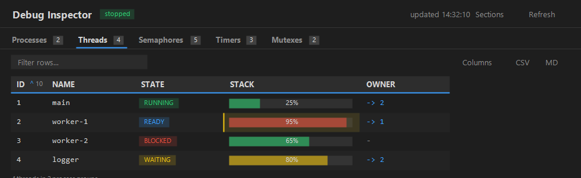

# Debug Inspector

**Visualize your own C/C++ data structures as live tables while debugging with GDB.**

Debug Inspector turns the in-memory data structures of *your* program — threads,
semaphores, mutexes, queues, linked lists, or any collection of structs — into
clean, sortable tables in a VS Code panel, refreshed every time the debugger
stops. You describe what to walk in a small JSON file; the extension knows
nothing about your types, so it works with any C/C++ codebase: bare-metal, a
hobby or commercial RTOS, or plain application code. It is **config-driven** and
**read-only** — it never writes your program's memory.

> Repository: https://github.com/nothing-githb/debug-inspector



*Representative panel — per-process threads with `State` badges, stack‑usage bars, an `Owner` cross‑reference link, change highlighting, and per‑column number‑base / sort controls.*

### See it in 20 seconds

1. Debug a C/C++ program with GDB (`type: cppdbg`).
2. Drop a `debug-inspector.json` at your workspace root naming one section per
   structure (e.g. a `linked_list` rooted at `g_thread_list`).
3. Run **"Debug Inspector: Open Panel"**.
4. Hit a breakpoint — every section appears as its own sortable table tab, and
   cells that changed since the last stop light up amber. Press *continue* and
   the panel re-reads on the next stop.

## Features

- **Config-driven & generic.** Point a section at any global expression — no
  assumptions about your layout, no changes to your program.
- **One tab per structure.** Each named section becomes its own table; tabs are
  generated dynamically and ordered as they appear in the file.
- **Three traversal modes.** `linked_list` (head pointer + `next` field),
  `array` (`count` elements with `.`/`->` access), and `index_list` (a list
  living inside an array, linked by a *next-index* field — empty slots skipped).
- **Grouping (tree).** Relate sections: a section can show, in its own tab, as a
  collapsible tree grouped under a master section (`groupBy` + `${master}`) — e.g.
  every process's semaphores under its process node — all at once, with a
  Flat-view toggle.
- **Graph view.** Toggle any section to an interactive node graph with **◉ Graph**
  (and back with **▤ Table**). Linked/index lists flow as a **serpentine grid** along
  their `next` relationship; grouped sections as **per-group swimlane columns** (label
  on top, members beneath); arrays as a card grid. Cards show the title, fields, state
  colour and usage bar. **Hover** highlights a node's neighbours, **click** opens a
  details panel, **drag a node** to reposition it (the placement is remembered and
  follows the row across refreshes), **drag the background** to pan, **scroll** to zoom,
  and **⤢ Fit** to recentre.
- **Usage bars.** Render a numeric field as a `used / max · %` bar
  (green → amber → red) with a field's `"bar"` — e.g. per-thread **stack usage**.
- **Cross-reference links.** A field with `"link"` renders as a clickable link to
  another object; clicking jumps to that section and highlights the matching row
  (e.g. a mutex's `Owner` → the owning thread).
- **Conditional fields.** A field with `"when"` only shows when its condition holds
  (else the cell is blank) — combine several on one discriminator for
  **tagged‑union / variant** rows (e.g. `Owner` when locked, else `Waiting`).
- **Edit values (opt-in).** Mark a field `"editable": true`, then right-click a
  cell → **Edit value…** to write it in the running program (GDB `set var`).
  Read-only otherwise; any cell can also be copied.
- **Hide columns by default.** Mark a field `"hidden": true` to start it
  collapsed (and unfetched) until you enable it from the ▦ Columns menu.
- **Manage sections (tabs).** Hide/show whole sections from the **▤ Sections**
  menu and reorder by **dragging a tab** (or a row in the menu) — instant
  (client-side), remembered per workspace. A section can also start hidden with
  `"hidden": true` in config.
- **Arbitrary root expressions** — anything valid in GDB, e.g.
  `g_kernel.pools[0]->thread_list`.
- **Generic `void*` buffers.** Reinterpret an untyped buffer as a typed array
  with `cast`, or transform each element before field access with `wrap`
  (cast a pointer, hop through a field, deref).
- **Live updates** on every stop, with a `running…` badge while the program runs
  and a `paused` pill when paused.
- **Sortable columns** — numeric/hex sorts numerically, text sorts alphabetically.
- **Filter & changed-only** — a per-tab filter box narrows rows as you type
  (focus-preserving); a **Changed** toggle shows only rows that moved since the
  last stop.
- **Copy out & export** — copy the (filtered) table as **CSV** or **Markdown** with
  one click (grouped tables add a `Group` column), or **⤓ JSON** in the top bar to
  export every section's data to a JSON file.
- **Per-column number base** — show any numeric column as **dec / hex / bin** via
  a click-to-cycle base button in the column header's top-right
  (`raw`→`bin`→`dec`→`hex`), or set a default in config with a field's `"base"`. Numeric columns are
  right-aligned with tabular figures.
- **Sticky header & full-value tooltips** — the header stays put on vertical
  scroll, and hovering any cell shows its full value in a tooltip.
- **Change highlighting** — changed cells are amber, with the previous value shown
  faded and struck-through next to the new one, plus an `N changed` badge.
- **Pick & reorder columns** — drag a header (blue drop indicator + drag-preview
  chip) or drag rows in the **▦ Columns** menu; show/hide via the menu or a
  header right-click. **Hidden columns are not read from GDB at all**; enabling
  one fetches it on the spot. Saved per workspace.
- **Refresh on demand or on change** — a Refresh button does a one-shot read, and
  the panel auto-refreshes when the config file changes on disk.
- **Pause / Resume** — stop the auto-refresh-on-stop (and the GDB queries it
  makes); Refresh still works on demand. Remembered per workspace.
- **Read-only & safe** — it only *reads* your globals via `print`, and never
  calls your functions. The only `set` commands it issues target its own
  `$`-prefixed GDB convenience-variable cursors, never your memory.
- **Tidy strings & empties** — fixed-size `char` arrays are shown only up to the
  first `\0` (trailing NULs / `'\000' <repeats N times>` dropped); an
  unreadable/inaccessible value or a NULL pointer (`0x0`) shows as a muted `-`;
  a plain integer `0` stays `0`.
- **Leveled, color-coded logs** — a *Debug Inspector* Output channel (rendered
  with the `log` language so timestamps/severities are colorized); pick `off` /
  `info` / `debug`.

## Requirements

- The [C/C++ extension](https://marketplace.visualstudio.com/items?itemName=ms-vscode.cpptools)
  (`ms-vscode.cpptools`) and a working GDB debug configuration (`type: cppdbg`).
- GDB available on your system.

## Install

- **From the Marketplace:** search for **Debug Inspector**, or open
  [the listing](https://marketplace.visualstudio.com/items?itemName=halistahasahin.debug-inspector)
  (`itemName=halistahasahin.debug-inspector`).
- **From a packaged build:** `code --install-extension dist/debug-inspector-<version>.vsix`
  (or in VS Code: Extensions → ⋯ → *Install from VSIX…*).

## Quick start

1. Debug your C/C++ program with `cppdbg` (GDB).
2. Put a `debug-inspector.json` at your workspace root (see the schema below).
3. Run **"Debug Inspector: Open Panel"** from the Command Palette.
4. When you hit a breakpoint the panel fills in; on *continue* it shows
   `running…` and refreshes again on the next stop.

## How it works

Debug Inspector registers a **debug adapter tracker** for the configured debug
types and listens for `stopped` / `continued` events. On stop (unless paused) it
grabs the top stack frame and reads your data **read-only** by issuing
`-exec print …` through the debug adapter's `evaluate` request, then strips
GDB's `$N =` / prompt noise from each result. Each section is walked according to
its `mode`:

- **linked_list** seeds a GDB convenience-variable cursor (`set $ri_<i> = root`),
  reads fields off the cursor, then advances `set $ri_<i> = $ri_<i>->next` until
  the cursor is NULL.
- **array** indexes a base expression `0…min(count, max)`.
- **index_list** starts at `head`, reads `root[idx]`, then follows the `next`
  *index* until it hits `nil`.

Only the **currently visible columns** are fetched, so hidden columns cost
nothing.

## Configuration

The config file (default `debug-inspector.json`) is a **JSON map of named
sections**. Each key whose value is an object with a string `mode` and an array
`fields` is a section; the key is its tab label. **Keys starting with `//` are
ignored** (handy for inline notes). Section order is preserved and drives tab
order.

### Schema

Every field, across all modes:

| Field     | Modes | Default | Meaning |
|-----------|-------|---------|---------|
| `mode`    | all | — (required) | `"linked_list"`, `"array"`, or `"index_list"`. Selects the traversal. |
| `root`    | all | — (required) | Starting expression in your program's own syntax (head pointer, array, or buffer). May contain `${master}` (grouping). |
| `fields`  | all | — (required) | Ordered list of `{ "label", "expr" }` columns. `label` is the header (and first column = row identity); `expr` is the accessor appended after the element, OR a computed expression using `${expr}` / `${wrapped_expr}` (the element, like `wrap`/`next`) — e.g. `"${expr}->stack_size - ${expr}->stack_used"` for arithmetic across two members. A field may add `"hidden": true` (start collapsed), `"base": "dec"\|"hex"\|"bin"` (default number base), `"bar": { "max": "<expr>", "warn": 75, "crit": 90 }` (render as a usage bar), and/or `"link": { "section": "<target>", "match": "<column>" }` (clickable cross-reference — jump to the target row whose `match` column equals this value; `match` defaults to the target's first column), and/or `"when": "<bool expr>"` (conditional field — blank when false; several on one discriminator make a variant/tagged‑union), `"editable": true` (right‑click → **Edit value…** writes via GDB `set var`; assignable fields only), `"wrap": "<tmpl>"` (transform the field value *after* access — `${expr}` = the accessed value, e.g. `expr:"data"` + `wrap:"((widget_t *)${expr})->x"`), and/or `"badge": { "<value>": "<color>" }` (value→color badge — names like `green`/`red`/`amber`/`cyan` or `#rrggbb` — overriding the built‑in `State` coloring). |
| `next`    | linked_list, index_list | — (set it) | linked_list: the pointer field to the next node (used as `cursor->next`). index_list: the field holding the next **index**, OR a `${expr}` template that computes it (like `wrap` — `${expr}` is the element; e.g. `"${expr}.link.idx"` or `"g_succ[${expr}.id]"`). The traversal uses this verbatim, so set it; it is only assumed to be `next` when building a grouped master's selector expression. |
| `head`    | index_list | — | Starting **index** expression, read once. May contain `${master}` (grouping). |
| `nil`     | index_list | `-1` | Sentinel index that ends the walk. May contain `${master}` (grouping). |
| `count`   | array | — (required for array) | Expression giving the element count; read once per refresh. If it can't be read it's treated as `0` (empty table). May contain `${master}` (grouping). |
| `access`  | array, index_list | `.` | Accessor between element and field — `"."` for a value element, `"->"` for a pointer. (linked_list always uses `->`.) |
| `cast`    | array, index_list | — | Cast applied to `root` to reinterpret an untyped buffer. **Write it in full** — no `*` is appended for you. |
| `wrap`    | all | — | Template that transforms the **element** before field access; `${expr}` = the element. |
| `label`   | master sections | row key | Expression titling each tree node when another section groups by this one. |
| `groupBy` | grouping sections | — | Name of a master section; renders this section as a tree in its own tab. Use `${master}` in `root`. |
| `hidden`  | all | `false` | Start this section's tab hidden (until you show it from the ▤ Sections menu). Ignored once you change section visibility in the UI. |
| `max`     | all | `1024` | Traversal upper bound (array loop cap; cycle/length guard for the lists). |

#### `cast` — reinterpret a buffer (written in full)

`cast` is applied to `root` to form the base, **as you wrote it** — no trailing
`*` is added. The base becomes `((cast)(root))` and elements index off it:

```
cast: "widget_t *",  root: "g_widgets.data"   →   ((widget_t *)(g_widgets.data))[i]
```

#### `wrap` — transform the element (deref, cast, field-hop)

`wrap` rewrites each element **before** its fields are read. `${expr}` is the
element; the element is parenthesized into the template, and **the whole wrap
output is parenthesized again** before the access is appended. So with element
`g_slots[i]` and `access: "->"`:

```
wrap: "((widget_t *)${expr})"   →   (((widget_t *)(g_slots[i])))->field
```

The extra outer parens fix precedence — a deref wrap `"*(${expr})"` yields
`(*(elem)).field` rather than the mis-parsed `*(elem).field`. `wrap` composes
**with** `cast`: `cast` is applied to `root` to form the element, then `wrap`
wraps that element. To reach the real data through a **field first** (each slot
is a `{ void *data; … }` wrapper), do the hop *inside* the wrap so it happens
before the cast:

```
wrap: "((widget_t *)(${expr}.data))",  access: "->"   →   ((widget_t *)(g_boxes[i].data))->field
```

#### Placeholder — `${master}`

Used in a section that sets `groupBy`. For **each** element of the master section,
`${master}` is substituted (in parentheses) into this section's `root`, `count`,
`head`, and `nil`, producing one group per parent. It resolves to the master
row's **fully processed element** — its own `cast` and `wrap` re-applied — so no
address-taking or extra cast is needed.

#### `label`

On a master section, `label` is an expression evaluated on the master element to
title each node in a grouped child. A `char*` rendered by GDB as `0x.. "init"` is
shown as just `init`. If a grouped child's master has no `label`, the group's key
(the master row's first-column value) is used instead.

---

### The three modes

**`linked_list`** — head pointer + `next` field. Seeds a cursor at `root`, reads
fields, advances `cursor = cursor->next`, stops at NULL (`0x0` or empty) or `max`.

```json
"processes": {
  "mode": "linked_list",
  "root": "g_process_list",
  "next": "next",
  "label": "name",
  "fields": [
    { "label": "PID",  "expr": "pid" },
    { "label": "Name", "expr": "name" }
  ]
}
```

**`array`** — `count` elements off `root` (cast-aware), indexed `0…min(count, max)`,
with `.`/`->` access. No NULL/sentinel logic.

```json
"timers": {
  "mode": "array",
  "root": "g_timers",
  "count": "g_timer_count",
  "access": ".",
  "fields": [
    { "label": "ID",      "expr": "id" },
    { "label": "Name",    "expr": "name" },
    { "label": "Period",  "expr": "period" },
    { "label": "Elapsed", "expr": "elapsed" },
    { "label": "Active",  "expr": "active" }
  ]
}
```

**`index_list`** — a list inside an array, linked by an integer index. Start at
`head`, read `root[idx]`, follow `next` (the next index) until it equals `nil`
(default `-1`). Slots that aren't on the chain are never visited. A visited-set
breaks cycles, and `max` bounds the length.

```json
"pool": {
  "mode": "index_list",
  "root": "g_slot_pool",
  "head": "g_slot_head",
  "next": "next",
  "nil": "-1",
  "access": ".",
  "fields": [
    { "label": "ID",   "expr": "id" },
    { "label": "Name", "expr": "name" },
    { "label": "Next", "expr": "next" }
  ]
}
```

With the chain `0 → 2 → 5` this shows three rows; slots `1/3/4` are skipped
because they are not on the chain.

If the next index isn't a plain field, `next` may be a **`${expr}` template**
(like `wrap`) — e.g. `"next": "${expr}.link.idx"`, or a lookup
`"next": "g_succ[${expr}.id]"`. Two placeholders are available:

- **`${expr}`** — the **un-wrapped** element (the *same* `${expr}` that `wrap`
  receives, so it means the same thing in both places).
- **`${wrapped_expr}`** — the element **after** `cast`/`wrap`, so you can reuse
  the cast without rewriting it: with `wrap: "((node_t *)${expr})"`, write
  `"next": "${wrapped_expr}->nxt"`.

Without either placeholder, `next` stays the simple `element<access>next` (using
the wrapped element).

---

### Grouping / tree (`groupBy` + `${master}`)

Relate one section to another: set `groupBy` to a master section's name and use
`${master}` in `root`, and this section renders in its **own tab** as a
collapsible tree of **all** master elements at once. The master's `label` titles
each node.

```json
{
  "processes": {
    "mode": "linked_list", "root": "g_process_list", "next": "next",
    "label": "name",
    "fields": [ { "label": "PID", "expr": "pid" }, { "label": "Name", "expr": "name" } ]
  },
  "semaphores": {
    "groupBy": "processes",
    "mode": "linked_list", "root": "${master}->sem_list", "next": "next",
    "fields": [
      { "label": "ID", "expr": "id" }, { "label": "Count", "expr": "count" },
      { "label": "Max", "expr": "max_count" }, { "label": "Waiting", "expr": "waiting" },
      { "label": "Discipline", "expr": "discipline" }
    ]
  }
}
```

The Semaphores tab lists each process as a collapsible node (caret + count badge)
with its semaphores beneath, titled by the process `name`. A **☰ Flat view**
toggle switches to a single ungrouped table of all rows. Grouping also works with
`index_list` and a per-parent head:

```json
"procSlots": {
  "groupBy": "processes",
  "mode": "index_list",
  "root": "g_slot_pool",
  "head": "${master}->slot_head",
  "next": "next",
  "nil": "-1",
  "access": ".",
  "fields": [ { "label": "ID", "expr": "id" }, { "label": "Name", "expr": "name" } ]
}
```

> Every grouped section populates on each stop with no clicking — all parents and
> their children are shown at once.

### Generic `void*` arrays (`cast`)

When a container stores its elements behind a `void *` buffer (a dynamic array),
give the element type with `cast` so the buffer can be indexed. For a buffer of
*pointers*, set `cast` to the pointer type and `access` to `"->"`.

```json
"widgets": {
  "mode": "array",
  "root": "g_widgets.data",
  "count": "g_widgets.size",
  "cast": "widget_t *",
  "access": ".",
  "fields": [
    { "label": "X", "expr": "x" }, { "label": "Y", "expr": "y" },
    { "label": "Label", "expr": "label" }
  ]
}
```

This reads each element as `((widget_t *)(g_widgets.data))[i].field`.

### `wrap` — element-array pointers and pre-cast field hops

For an **array of pointers** (`void *g_slots[3]`, each a `widget_t*`), cast the
element inside `wrap` and use `->`:

```json
"slots": {
  "mode": "array",
  "root": "g_slots",
  "count": "3",
  "wrap": "((widget_t *)${expr})",
  "access": "->",
  "fields": [
    { "label": "X", "expr": "x" }, { "label": "Y", "expr": "y" },
    { "label": "Label", "expr": "label" }
  ]
}
```

→ `(((widget_t *)(g_slots[i])))->x`.

For a **field-first hop** (`box_t g_boxes[3]`, each `{ void *data; int kind }`),
reach `.data` inside the wrap *before* casting:

```json
"boxes": {
  "mode": "array",
  "root": "g_boxes",
  "count": "3",
  "wrap": "((widget_t *)(${expr}.data))",
  "access": "->",
  "fields": [
    { "label": "X", "expr": "x" }, { "label": "Label", "expr": "label" }
  ]
}
```

→ `((widget_t *)(g_boxes[i].data))->x`.

### `index_list` — extra notes

`cast` / `wrap` / `access` work exactly as in `array` mode. Write `nil` the way
GDB prints the index (usually decimal). A visited-set and the `max` bound guard
against cycles and runaway chains.

### Usage bars (`bar`)

Give a numeric field a `bar` and it renders as a horizontal `used / max · NN%`
bar, colored green → amber (≥ `warn` %) → red (≥ `crit` %). `bar.max` is a sibling
expression on the same element (e.g. `stack_size`) or a constant; `warn` / `crit`
default to 75 / 90. The field's own `expr` is the *used* value.

```json
{
  "threads": {
    "groupBy": "processes",
    "mode": "linked_list", "root": "${master}->thread_list", "next": "next",
    "fields": [
      { "label": "ID", "expr": "id" },
      { "label": "Name", "expr": "name" },
      { "label": "Stack", "expr": "stack_used", "bar": { "max": "stack_size", "warn": 75, "crit": 90 } }
    ]
  }
}
```

This shows each thread's stack usage as `stack_used / stack_size`. Shorthand:
`"bar": "stack_size"` (default thresholds).

### Other per-column field options

Any `fields` entry can carry these — one example each:

```jsonc
// Computed value: ${expr} (raw) / ${wrapped_expr} (after cast/wrap) — arithmetic, casts, ternaries
{ "label": "Free", "expr": "${expr}->stack_size - ${expr}->stack_used" }

// Number base: dec / hex / bin default (also a 10/16/2 toggle in the column header)
{ "label": "Handle", "expr": "id", "base": "hex" }

// Cross-reference link: click jumps to the matching row in another section (only if a match exists)
{ "label": "Owner", "expr": "owner", "link": { "section": "threads", "match": "ID" } }

// Conditional / tagged-union: show only when true; several on one discriminator = variant rows
{ "label": "Owner",   "expr": "owner",   "when": "locked" },
{ "label": "Waiting", "expr": "waiters", "when": "${expr}.locked == 0" }

// Editable: right-click -> Edit value writes via GDB `set var` (assignable fields only)
{ "label": "Locked", "expr": "locked", "editable": true }

// Hidden by default: start collapsed + unfetched; enable from the ▦ Columns menu
{ "label": "Next", "expr": "next", "hidden": true }

// Field wrap: transform the value AFTER access (${expr} = the accessed value)
{ "label": "X", "expr": "data", "wrap": "((widget_t *)${expr})->x" }

// Badge colors: map values to colored badges (overrides built-in State coloring); names or #rrggbb
{ "label": "State", "expr": "state", "badge": { "RUNNING": "green", "READY": "cyan", "BLOCKED": "red", "WAITING": "amber" } }
```

## Settings

| Setting                     | Default                 | Description |
|-----------------------------|-------------------------|-------------|
| `debugInspector.configPath`  | `debug-inspector.json`   | Path to the config file. **Absolute paths are used as-is** (work even with no workspace folder); a **relative path resolves against the workspace root**. Changing it re-creates the file watcher. |
| `debugInspector.logLevel`    | `info`                  | Output channel verbosity: `off` / `info` / `debug`. Applied live on change. |
| `debugInspector.debugTypes`  | `["cppdbg"]`            | Debug adapter types the tracker attaches to. Use `cppdbg` for GDB. |

## Commands

- **Debug Inspector: Open Panel** (`debugInspector.open`) — open or reveal the
  panel; if the debugger is already stopped, it refreshes immediately.
- **Debug Inspector: Show Log** (`debugInspector.showLog`) — reveal the
  *Debug Inspector* Output channel.

## Troubleshooting & logging

Open **View → Output → "Debug Inspector"** (or run **"Debug Inspector: Show Log"**)
to see what the extension is doing. The channel uses the built-in `log` language
id so the theme color-codes timestamps, severities, and values; each line is
`YYYY-MM-DD HH:MM:SS.mmm [LEVEL] message`. Set the level with
**`debugInspector.logLevel`**:

- **`off`** — no logging.
- **`info`** (default) — milestones (activate, refresh, selection) **plus**
  warnings/errors, including GDB access **failures**. Use this when a column comes
  up empty or a `root` / `cast` / `next` doesn't resolve.
- **`debug`** — everything: per-section resolved traversal and row counts, the
  resolved `${master}`, **every prepared GDB access string**
  (`gdb ▸`) and **its result** (`gdb ◂`), and a line per traversal **step**. For
  an `index_list` each hop is shown as
  `step N: idx X → next [ root[idx].next ] = "v" → idx N`; for a `linked_list`,
  `node N` per advance — so you can see exactly how `next` is resolved at each hop.

When a cell shows a muted `-`, the underlying value was unreadable (GDB errors
like `cannot access memory`, `optimized out`, `no symbol`) or a NULL pointer
(`0x0`). The raw value is preserved underneath, so sorting, summaries, and
change-detection still work.

## Project layout

```
extension/        the extension source (compiled & packaged)
  src/extension.ts
test-workspace/   a small C example + .vscode templates for trying it
dist/             packaged .vsix builds
```

## Build from source

```bash
cd extension
npm install
npm run compile          # tsc -> out/extension.js
npx @vscode/vsce package # produces a .vsix
```

For live development, open `extension/` in VS Code and press **F5** to launch an
Extension Development Host.

## License

[MIT](extension/LICENSE)
